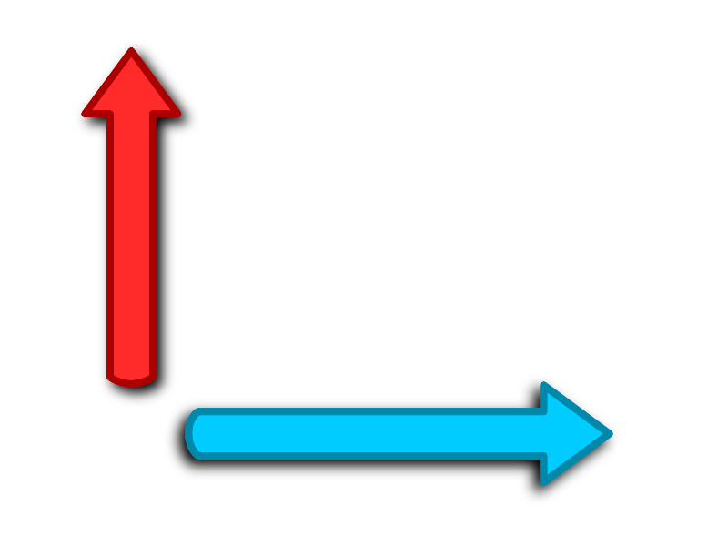

# e2D
## A Python Game Development Library

<p align="center">
  
</p>

> e2D is an open-source Python game development library that aims to simplify the process of creating 2D games and apps using the popular Pygame framework. It provides a collection of utilities and environments to speed up game development and make it more enjoyable for developers of all skill levels.

## Features

- **Easy-to-Use**: e2D is designed with simplicity in mind, making it accessible to both beginners and experienced developers.
- **Efficient handling of keyboard and mouse** input for interactive gameplay.
- **Powerful *vector calculations*** for easy position manipulation, *distance calculation*, and *angle manipulation*.
- **Flexible *color manipulation*** functions for smooth transitions and visual effects.
- **Convenient positioning and *collision detection*** functions to handle game object interactions.
- **Versatile**: The library offers various utilities and environments that cater to different game genres and styles.
- **Customizable**: Developers can extend and modify e2D's functionality to suit their specific project requirements.
- **Fast and Efficient**: e2D can be used on top of Pygame, which is known for its performance and efficiency.
- **Open-Source**: e2D is distributed under the MIT License, allowing for free and unrestricted usage and modification.

## Installation

To install e2D, you can use pip:
```bash
pip install e2D
```
```bash
pip3 install e2D
```

##
# Usage

# 1. `__init__.py__`

##### The `__init__.py` module is the entry point of the e2D library. It provides the following classes:

#### Key Features:
- Easy Initialization: The V2 class can be easily initialized by providing the x and y components of the vector.
- Clean Representation: The V2 class provides a clean and readable representation of 2D vectors, making it easy to work with and understand.
- Lightweight: The V2 class is a lightweight implementation, making it suitable for performance-critical applications.
    
### Example 1: Basic Vector Operations

```python
from e2D import V2

# Create some 2D vectors
vector1 = V2(3.0, 4.0)
vector2 = V2(-1.0, 2.5)

# Perform vector addition
result_add = vector1 + vector2
print("Vector Addition:", result_add)  # Output: Vector Addition: V2(2.0, 6.5)

# Perform vector subtraction
result_sub = vector1 - vector2
print("Vector Subtraction:", result_sub)  # Output: Vector Subtraction: V2(4.0, 1.5)

# Perform vector scaling
scalar = 2.5
scaled_vector = vector1 * scalar
print("Vector Scaling:", scaled_vector)  # Output: Vector Scaling: V2(7.5, 10.0)

# Calculate the dot product of two vectors
dot_product = vector1.dot(vector2)
print("Dot Product:", dot_product)  # Output: Dot Product: 0.5

# Calculate the magnitude (length) of a vector
magnitude = vector1.magnitude()
print("Magnitude:", magnitude)  # Output: Magnitude: 5.0

# Normalize a vector (convert to unit vector)
normalized_vector = vector1.normalize()
print("Normalized Vector:", normalized_vector)  # Output: Normalized Vector: V2(0.6, 0.8)

# Calculate the distance between two points represented by vectors
distance = vector1.distance_to(vector2)
print("Distance between vectors:", distance)  # Output: Distance between vectors: 6.324555320336759
```

### Example 2: Using Vectors in a Simple Physics Simulation

```python
from e2D import V2

# Define the position and velocity of an object
position = V2(0.0, 0.0)
velocity = V2(5.0, 2.0)

# Update the position based on velocity and time
time_step = 0.1
position += velocity * time_step

print("New Position:", position)  # Output: New Position: V2(0.5, 0.2)
```

### Example 3: Calculating Forces in a 2D Physics Engine

```python
from e2D import V2

# Define a force acting on an object
force = V2(10.0, -5.0)

# Define the mass of the object
mass = 2.0

# Calculate the acceleration of the object using Newton's second law (F = ma)
acceleration = force / mass

print("Acceleration:", acceleration)  # Output: Acceleration: V2(5.0, -2.5)
```

### Example 4: Interpolating Between Two Points

```python
from e2D import V2

# Define two points A and B
point_a = V2(0.0, 0.0)
point_b = V2(10.0, 5.0)

# Interpolate between the two points at t = 0.3
t = 0.3
interpolated_point = V2.lerp(point_a, point_b, t)

print("Interpolated Point:", interpolated_point)  # Output: Interpolated Point: V2(3.0, 1.5)
```

### Example 5: Using Vectors in a Game Character

```python
from e2D import V2

class Character:
    def __init__(self, position):
        self.position = position
        self.velocity = V2(0.0, 0.0)

    def update(self, time_step):
        # Update the position based on velocity and time
        self.position += self.velocity * time_step

    def apply_force(self, force):
        # Calculate the acceleration and update velocity based on the applied force
        mass = 1.0  # Assume mass is 1 for simplicity
        acceleration = force / mass
        self.velocity += acceleration

# Create a character at position (0, 0)
character = Character(V2(0.0, 0.0))

# Apply a force to the character
force = V2(5.0, 2.0)
character.apply_force(force)

# Update the character's position after 0.1 seconds
time_step = 0.1
character.update(time_step)

print("Character Position:", character.position)  # Output: Character Position: V2(0.5, 0.2)
```

> These examples demonstrate various use cases of the `V2` or `Vector2D` class, including basic vector operations, physics simulations, interpolation, and game character movement. The `V2` class is versatile and can be used in a wide range of 2D applications and simulations.

##
# 2. `envs.py`

The `envs.py` module provides the `RootEnv` class, which acts as the root environment for a Pygame-based application.

```python
from e2D.envs import *

class Game:
    def __init__(self):
        self.position = V2(100, 100)
        self.velocity = V2(5, 2)

    def update(self):
        self.position = (self.position[0] + self.velocity[0], self.position[1] + self.velocity[1])

    def draw(self):
        rootEnv.print("Game Position: {}".format(self.position), rootEnv.screen_size * .5, center_y=True, center_x=True)

# Create a RootEnv with a screen size of 800x600 and target FPS of 60
rootEnv = RootEnv(screen_size=V2(800, 600), target_fps=60)

# Initialize the game with the Game class
game = Game()
rootEnv.init(game)

# Game loop
while not rootEnv.quit:
    rootEnv.frame()
```
##
# 2. `utils.py`
The `utils.py` module provides various utility classes and functions for input handling and more.
```python
from e2D.envs import *
# e2D.utils is already imported

class Game:
    def __init__(self):
        self.position = V2(100, 100)

    def update(self):
        # Move the position based on arrow key presses
        keyboard = rootEnv.keyboard
        if keyboard.get_key(pg.K_UP, mode=KEY_MODE_PRESSED):
            self.position = (self.position[0], self.position[1] - 5)
        if keyboard.get_key(pg.K_DOWN, mode=KEY_MODE_PRESSED):
            self.position = (self.position[0], self.position[1] + 5)
        if keyboard.get_key(pg.K_LEFT, mode=KEY_MODE_PRESSED):
            self.position = (self.position[0] - 5, self.position[1])
        if keyboard.get_key(pg.K_RIGHT, mode=KEY_MODE_PRESSED):
            self.position = (self.position[0] + 5, self.position[1])

    def draw(self):
        # Draw a circle at the mouse position when the left mouse button is pressed
        mouse = rootEnv.mouse
        if mouse.just_pressed[0]:
            pg.draw.circle(rootEnv.screen, (255,127,0), rootEnv.mouse.position(), 10)
        rootEnv.print("Game Position: {}".format(self.position), V2(10, 10))

# Create a RootEnv with a screen size of 800x600 and target FPS of 60
rootEnv = RootEnv(screen_size=V2(800, 600), target_fps=60)

# Initialize the game with the Game class
game = Game()
rootEnv.init(game)

# Game loop
while not rootEnv.quit:
    rootEnv.frame()
```

## Contributing

Contributions to e2D are welcome! If you find any bugs or have suggestions for improvements, feel free to open an issue or submit a pull request.

## License

e2D is open-source software licensed under the [MIT License](LICENSE).

## Contact

For inquiries, you can reach me at [ricomari2006@gmail.com](mailto:ricomari2006@gmail.com).

## Acknowledgements
The e2D is developed and maintained by [marick-py](https://github.com/marick-py) but is inspired by the Pygame library and various other game development resources. We would like to express our gratitude to the Pygame community and all the developers who have contributed to the open-source projects that made e2D possible.

Thank you for using e2D! Happy game development! 🚀
